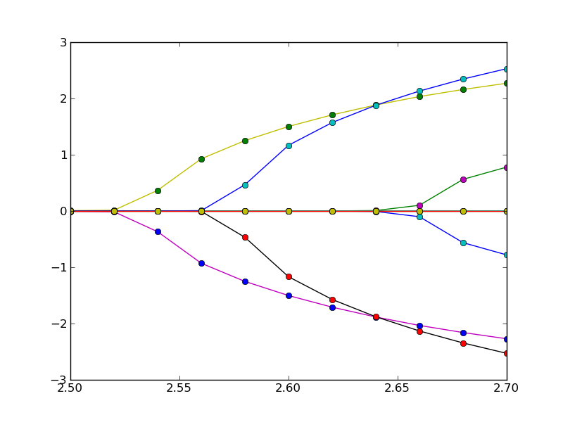

.. _examples-page:

Example scripts
===============

Copy-paste the text blocks below and save them as .py files to try them out.

Ground state volume of bcc bulk iron
------------------------------------

.. sourcecode:: python

   #!/usr/bin/python
   
   # An example script of how to automatically
   # calculate the equilibrium volume and 
   # bulk modulus of bulk bcc Fe using pyEMTO.
   
   import pyemto
   
   emtopath = "/wrk/hpleva/pyEMTO_examples/fe" # Define a folder for our KGRN and KFCD input and output files.
   latpath  = "/wrk/hpleva/structures"         # Define a folder where the BMDL, KSTR and KFCD input and output files
                                               # will be located.
   
   fe = pyemto.System(folder=emtopath)  # Create a new instance of the pyemto System-class.
   
   # Let's calculate the equilibrium volume and bulk modulus of Fe.
   
   # Initialize the system using the bulk.() function:
   
   fe.bulk(lat     = 'bcc',   # We want to use the bcc structure.
           latpath = latpath, # Path to the folder where the structure files are located.
           afm     = 'F',     # We want to do a ferromagnetic calculation.
           atoms   = ['Fe'],  # A list of atoms.
           splts   = [2.0],   # A list of magnetic splittings.
           expan   = 'M',     # We want to use the double-Taylor expansion.
           sofc    = 'Y',     # We want to use soft-core approximation.
           xc      = 'PBE',   # We want to use the PBE functional.
           amix    = 0.05,    # Density mixing.
           nky     = 21)      # Number of k-points.  

   sws = [2.6,2.62,2.64,2.66,2.68,2.70] # A list of Wigner-Seitz radii
   
   # Generate all the necessary input files with this function:
   #fe.lattice_constants_batch_generate(sws=sws)
   
   #The newly created batch scripts are then submitted by hand.

   # Analyze the results using this function once all the calculations
   # have finished:
   #fe.lattice_constants_analyze(sws=sws)
   
   # This function combines the features of the previous two:
   fe.lattice_constants_batch_calculate(sws=sws)

The output of this script should look like this::

   Submitted batch job 1021841
   Submitted batch job 1021842
   Submitted batch job 1021843
   Submitted batch job 1021844
   Submitted batch job 1021845
   Submitted batch job 1021846

   wait_for_jobs: Submitted 6 jobs
   wait_for_jobs: Will be requesting job statuses every 60 seconds

   0:01:00 {'RUNNING': 6} (  0% completion)
   0:02:00 {'RUNNING': 6} (  0% completion)
   0:03:00 {'RUNNING': 6} (  0% completion)
   0:04:00 {'COMPLETED': 4, 'RUNNING': 2} ( 66% completion)
   0:05:00 {'COMPLETED': 6} (100% completion)
   completed 6 batch jobs in 0:05:00

   *****lattice_constants_analyze*****

   ********************************
   lattice_constants_analyze(cubic)
   ********************************
     SWS        Energy
   2.600000  -2545.605517
   2.620000  -2545.606394
   2.640000  -2545.606680
   2.660000  -2545.606435
   2.680000  -2545.605705
   2.700000  -2545.604616

   5.2.2015 -- 16:21:13
   JOBNAM = fe1.00 -- PBE

   Using morse function

   Chi squared         = 2.7459052408e-10
   Reduced Chi squared = 1.3729526204e-10
   R squared           = 0.999907593903

   morse parameters:

   a      =     0.117551
   b      =  -122.663728
   c      = 32000.491593
   lambda =     2.370150

   Ground state parameters:

   V0           =     2.640005 Bohr^3 (unit cell volume)
                =     2.640005 Bohr   (WS-radius)
   E0           = -2545.606678 Ry
   Bmod         =   195.204183 GPa
   Grun. param. =     3.128604

   sws            Einp           Eout          Residual       err (% * 10**6)
   2.600000  -2545.605517  -2545.605515      0.000002       -0.000870
   2.620000  -2545.606394  -2545.606400     -0.000006        0.002524
   2.640000  -2545.606680  -2545.606678      0.000002       -0.000950
   2.660000  -2545.606435  -2545.606426      0.000009       -0.003632
   2.680000  -2545.605705  -2545.605716     -0.000011        0.004368
   2.700000  -2545.604616  -2545.604612      0.000004       -0.001440

   lattice_constants_analyze(cubic):
   sws0 =      2.640005
   B0   =    195.204183
   E0   =  -2545.606678

Elastic constants of bcc bulk iron
----------------------------------

.. sourcecode:: python

   #!/usr/bin/python

   # An example script showing how to automatically calculate
   # the elastic constants of bulk bcc Fe using pyEMTO.

   import pyemto

   emtopath = "/wrk/hpleva/pyEMTO_examples/fe_elastic_constants" # Define a folder for our KGRN and KFCD input and output files.
   latpath  = "/wrk/hpleva/structures"                           # Define a folder where the BMDL, KSTR and KFCD input and output files
                                                                 # will be located.

   fe = pyemto.System(folder=emtopath)  # Create a new instance of the pyemto System-class.

   # Let's calculate the elastic constants of Fe.

   fe.bulk(lat     = 'bcc',   # We want to use the bcc structure.
           latpath = latpath, # Path to the folder where the structure files are located.
           afm     = 'F',     # We want to do a ferromagnetic calculation.
           atoms   = ['Fe'],  # A list of atoms.
           splts   = [2.0],   # A list of magnetic splittings.
           expan   = 'M',     # We want to use the double-Taylor expansion.
           sofc    = 'Y',     # We want to use soft-core approximation.
           xc      = 'PBE',   # We want to use the PBE functional.
           amix    = 0.05)    # Mixing parameter.  

   sws0 = 2.64 # Eq. WS-radius that we computed previously.
   B0   = 195  # Eq. bulk modulus.

   # Generate all the necessary input files with this function:
   #fe.elastic_constants_batch_generate(sws=sws0)

   #The newly created batch scripts are then submitted by hand.

   # Analyze the results using this function once all the calculations
   # have finished:
   #fe.elastic_constants_analyze(sws=sws,bmod=B0)

   # This function combines the features of the previous two:
   fe.elastic_constants_batch_calculate(sws=sws0,bmod=B0)

The output of this script should look like this::

   Submitted batch job 1021848
   Submitted batch job 1021849
   Submitted batch job 1021850
   Submitted batch job 1021851
   Submitted batch job 1021852
   Submitted batch job 1021853
   Submitted batch job 1021854
   Submitted batch job 1021855
   Submitted batch job 1021856
   Submitted batch job 1021857
   Submitted batch job 1021858
   Submitted batch job 1021859

   wait_for_jobs: Submitted 12 jobs
   wait_for_jobs: Will be requesting job statuses every 60 seconds

   0:01:00 {'RUNNING': 12} (  0% completion)
   0:02:00 {'RUNNING': 12} (  0% completion)
   0:03:00 {'RUNNING': 12} (  0% completion)
   0:04:00 {'RUNNING': 12} (  0% completion)
   0:05:00 {'RUNNING': 12} (  0% completion)
   0:06:00 {'RUNNING': 12} (  0% completion)
   0:07:00 {'RUNNING': 12} (  0% completion)
   0:08:01 {'RUNNING': 12} (  0% completion)
   0:09:01 {'RUNNING': 12} (  0% completion)
   0:10:01 {'RUNNING': 12} (  0% completion)
   0:11:01 {'RUNNING': 12} (  0% completion)
   0:12:01 {'RUNNING': 12} (  0% completion)
   0:13:01 {'RUNNING': 12} (  0% completion)
   0:14:01 {'RUNNING': 12} (  0% completion)
   0:15:01 {'RUNNING': 12} (  0% completion)
   0:16:01 {'RUNNING': 12} (  0% completion)
   0:17:02 {'RUNNING': 12} (  0% completion)
   0:18:02 {'RUNNING': 12} (  0% completion)
   0:19:02 {'RUNNING': 12} (  0% completion)
   0:20:02 {'RUNNING': 12} (  0% completion)
   0:21:02 {'RUNNING': 12} (  0% completion)
   0:22:02 {'RUNNING': 12} (  0% completion)
   0:23:02 {'RUNNING': 12} (  0% completion)
   0:24:02 {'RUNNING': 12} (  0% completion)
   0:25:03 {'RUNNING': 12} (  0% completion)
   0:26:03 {'RUNNING': 12} (  0% completion)
   0:27:03 {'RUNNING': 12} (  0% completion)
   0:28:03 {'RUNNING': 12} (  0% completion)
   0:29:03 {'RUNNING': 12} (  0% completion)
   0:30:03 {'RUNNING': 12} (  0% completion)
   0:31:03 {'RUNNING': 12} (  0% completion)
   0:32:03 {'RUNNING': 12} (  0% completion)
   0:33:03 {'RUNNING': 12} (  0% completion)
   0:34:04 {'RUNNING': 12} (  0% completion)
   0:35:04 {'RUNNING': 12} (  0% completion)
   0:36:04 {'RUNNING': 12} (  0% completion)
   0:37:04 {'RUNNING': 12} (  0% completion)
   0:38:04 {'RUNNING': 12} (  0% completion)
   0:39:04 {'RUNNING': 12} (  0% completion)
   0:40:04 {'RUNNING': 12} (  0% completion)
   0:41:04 {'RUNNING': 12} (  0% completion)
   0:42:05 {'RUNNING': 12} (  0% completion)
   0:43:05 {'RUNNING': 12} (  0% completion)
   0:44:05 {'RUNNING': 12} (  0% completion)
   0:45:05 {'RUNNING': 12} (  0% completion)
   0:46:05 {'RUNNING': 12} (  0% completion)
   0:47:05 {'RUNNING': 12} (  0% completion)
   0:48:05 {'RUNNING': 12} (  0% completion)
   0:49:05 {'RUNNING': 12} (  0% completion)
   0:50:05 {'RUNNING': 12} (  0% completion)
   0:51:06 {'RUNNING': 12} (  0% completion)
   0:52:06 {'RUNNING': 12} (  0% completion)
   0:53:06 {'RUNNING': 12} (  0% completion)
   0:54:06 {'RUNNING': 12} (  0% completion)
   0:55:06 {'RUNNING': 12} (  0% completion)
   0:56:06 {'RUNNING': 12} (  0% completion)
   0:57:06 {'RUNNING': 12} (  0% completion)
   0:58:06 {'RUNNING': 12} (  0% completion)
   0:59:07 {'RUNNING': 11, 'COMPLETED': 1} (  8% completion)
   1:00:07 {'RUNNING': 10, 'COMPLETED': 2} ( 16% completion)
   1:01:07 {'RUNNING': 9, 'COMPLETED': 3} ( 25% completion)
   1:02:07 {'RUNNING': 9, 'COMPLETED': 3} ( 25% completion)
   1:03:07 {'RUNNING': 9, 'COMPLETED': 3} ( 25% completion)
   1:04:07 {'RUNNING': 9, 'COMPLETED': 3} ( 25% completion)
   1:05:07 {'RUNNING': 9, 'COMPLETED': 3} ( 25% completion)
   1:06:07 {'RUNNING': 9, 'COMPLETED': 3} ( 25% completion)
   1:07:08 {'RUNNING': 9, 'COMPLETED': 3} ( 25% completion)
   1:08:08 {'RUNNING': 8, 'COMPLETED': 4} ( 33% completion)
   1:09:08 {'COMPLETED': 6, 'RUNNING': 6} ( 50% completion)
   1:10:08 {'COMPLETED': 6, 'RUNNING': 6} ( 50% completion)
   1:11:08 {'COMPLETED': 6, 'RUNNING': 6} ( 50% completion)
   1:12:08 {'COMPLETED': 6, 'RUNNING': 6} ( 50% completion)
   1:13:08 {'COMPLETED': 6, 'RUNNING': 6} ( 50% completion)
   1:14:08 {'COMPLETED': 6, 'RUNNING': 6} ( 50% completion)
   1:15:09 {'COMPLETED': 6, 'RUNNING': 6} ( 50% completion)
   1:16:09 {'COMPLETED': 6, 'RUNNING': 6} ( 50% completion)
   1:17:09 {'COMPLETED': 6, 'RUNNING': 6} ( 50% completion)
   1:18:09 {'COMPLETED': 6, 'RUNNING': 6} ( 50% completion)
   1:19:09 {'COMPLETED': 7, 'RUNNING': 5} ( 58% completion)
   1:20:09 {'COMPLETED': 7, 'RUNNING': 5} ( 58% completion)
   1:21:09 {'COMPLETED': 8, 'RUNNING': 4} ( 66% completion)
   1:22:09 {'COMPLETED': 10, 'RUNNING': 2} ( 83% completion)
   1:23:10 {'COMPLETED': 10, 'RUNNING': 2} ( 83% completion)
   1:24:10 {'COMPLETED': 10, 'RUNNING': 2} ( 83% completion)
   1:25:10 {'COMPLETED': 11, 'RUNNING': 1} ( 91% completion)
   1:26:10 {'COMPLETED': 12} (100% completion)
   completed 12 batch jobs in 1:26:10

   ***cubic_elastic_constants***

   fe1.00

   c11(GPa) = 299.60
   c12(GPa) = 142.70
   c44(GPa) = 105.95
   c' (GPa) =  78.45
   B  (GPa) = 195.00

   Voigt average:

   BV(GPa)  = 195.00
   GV(GPa)  =  94.95
   EV(GPa)  = 245.07
   vV(GPa)  =   0.29

   Reuss average:

   BR(GPa)  = 195.00
   GR(GPa)  =  92.92
   ER(GPa)  = 240.55
   vR(GPa)  =   0.29

   Hill average:

   BH(GPa)  = 195.00
   GH(GPa)  =  93.93
   EH(GPa)  = 242.81
   vH(GPa)  =   0.29

   Elastic anisotropy:

   AVR(GPa)  =   0.01

Ground state volume and elastic constants of hcp bulk titanium
--------------------------------------------------------------

.. sourcecode:: python

   #!/usr/bin/python

   # This script will automatically accomplish:

   #  1. Calculate the equilibrium volume and bulk modulus of hcp Ti.
   #  2. Calculate the elastic constants of hcp Ti.

   import pyemto
   import os
   import numpy as np

   # It is recommended to always use absolute paths
   folder = os.getcwd()                # Get current working directory.
   latpath = "/wrk/hpleva/structures"  # Folder where the structure files are located.
   emtopath = folder+"/ti_hcp"         # Folder where the calculation take place.

   ti_hcp=pyemto.System(folder=emtopath)

   # Initialize the bulk system using the bulk() function:
   ti_hcp.bulk(lat='hcp',
               latpath=latpath,
               atoms=['Ti'],
               sws=3.0,
               amix=0.02,
               efmix=0.9,
               expan='M',
               sofc='Y',
               xc='P07',           # Use PBEsol
               nky=31,             # k-points
               nkz=19,             # k-points
               runtime='24:00:00') # Allow large enough timelimit for SLURM   

   sws = np.linspace(2.9,3.1,7) # A list of 7 different volumes from 2.9 to 3.1 

   sws0,ca0,B0,e0,R0,cs0 = ti_hcp.lattice_constants_batch_calculate(sws=sws)
   ti_hcp.elastic_constants_batch_calculate(sws=sws0,bmod=B0,ca=ca0,R=R0,cs=cs0)

   # If the batch jobs are submitted by hand use these functions.

   # To evaluate the results, comment out the _generate functions
   # and uncomment the _analyze functions.

   ti_hcp.lattice_constants_batch_generate(sws=sws)
   #ti_hcp.lattice_constants_analyze(sws=sws)

   # Results. These are inputed to the elastic_constants functions.
   #sws0 =      3.002260
   #ca0  =      1.610122
   #B0   =    115.952318
   #E0   =  -1705.738844
   #R0   =      0.019532
   #cs0  =    498.360422

   #ti_hcp.elastic_constants_batch_generate(sws=sws0,ca=ca0)
   #ti_hcp.elastic_constants_analyze(sws=sws0,bmod=B0,ca=ca0,R=R0,cs=cs0)

The output of this script should look like this::

   Submitted batch job 1021973
   Submitted batch job 1021974
   Submitted batch job 1021975
   Submitted batch job 1021976
   Submitted batch job 1021977
   Submitted batch job 1021978
   Submitted batch job 1021979
   Submitted batch job 1021980
   Submitted batch job 1021981
   Submitted batch job 1021982
   Submitted batch job 1021983
   Submitted batch job 1021984
   Submitted batch job 1021985
   Submitted batch job 1021986
   Submitted batch job 1021987
   Submitted batch job 1021988
   Submitted batch job 1021989
   Submitted batch job 1021990
   Submitted batch job 1021991
   Submitted batch job 1021992
   Submitted batch job 1021993
   Submitted batch job 1021994
   Submitted batch job 1021995
   Submitted batch job 1021996
   Submitted batch job 1021997
   Submitted batch job 1021998
   Submitted batch job 1021999
   Submitted batch job 1022000
   Submitted batch job 1022001
   Submitted batch job 1022002
   Submitted batch job 1022003
   Submitted batch job 1022004
   Submitted batch job 1022005
   Submitted batch job 1022006
   Submitted batch job 1022007
   Submitted batch job 1022008
   Submitted batch job 1022009
   Submitted batch job 1022010
   Submitted batch job 1022011
   Submitted batch job 1022012
   Submitted batch job 1022013
   Submitted batch job 1022014
   Submitted batch job 1022015
   Submitted batch job 1022016
   Submitted batch job 1022017
   Submitted batch job 1022018
   Submitted batch job 1022019
   Submitted batch job 1022020
   Submitted batch job 1022021
   ()
   wait_for_jobs: Submitted 49 jobs
   wait_for_jobs: Will be requesting job statuses every 60 seconds

   0:01:00 {'RUNNING': 49} (  0% completion)
   0:02:00 {'RUNNING': 49} (  0% completion)
   0:03:00 {'RUNNING': 49} (  0% completion)
   0:04:00 {'RUNNING': 49} (  0% completion)
   0:05:01 {'RUNNING': 49} (  0% completion)
   0:06:01 {'RUNNING': 49} (  0% completion)
   0:07:01 {'RUNNING': 49} (  0% completion)
   0:08:01 {'RUNNING': 49} (  0% completion)
   0:09:02 {'RUNNING': 49} (  0% completion)
   0:10:02 {'RUNNING': 49} (  0% completion)
   0:11:02 {'RUNNING': 49} (  0% completion)
   0:12:02 {'RUNNING': 49} (  0% completion)
   0:13:02 {'RUNNING': 49} (  0% completion)
   0:14:02 {'RUNNING': 49} (  0% completion)
   0:15:02 {'RUNNING': 49} (  0% completion)
   0:16:03 {'RUNNING': 49} (  0% completion)
   0:17:03 {'RUNNING': 49} (  0% completion)
   0:18:03 {'RUNNING': 49} (  0% completion)
   0:19:03 {'RUNNING': 49} (  0% completion)
   0:20:03 {'RUNNING': 49} (  0% completion)
   0:21:03 {'RUNNING': 49} (  0% completion)
   0:22:03 {'RUNNING': 49} (  0% completion)
   0:23:03 {'RUNNING': 49} (  0% completion)
   0:24:04 {'RUNNING': 49} (  0% completion)
   0:25:04 {'RUNNING': 49} (  0% completion)
   0:26:04 {'RUNNING': 48, 'COMPLETED': 1} (  2% completion)
   0:27:04 {'RUNNING': 47, 'COMPLETED': 2} (  4% completion)
   0:28:04 {'RUNNING': 46, 'COMPLETED': 3} (  6% completion)
   0:29:04 {'RUNNING': 42, 'COMPLETED': 7} ( 14% completion)
   0:30:04 {'RUNNING': 40, 'COMPLETED': 9} ( 18% completion)
   0:31:05 {'COMPLETED': 12, 'RUNNING': 37} ( 24% completion)
   0:32:05 {'COMPLETED': 15, 'RUNNING': 34} ( 30% completion)
   0:33:05 {'COMPLETED': 15, 'RUNNING': 34} ( 30% completion)
   0:34:05 {'COMPLETED': 15, 'RUNNING': 34} ( 30% completion)
   0:35:05 {'COMPLETED': 18, 'RUNNING': 31} ( 36% completion)
   0:36:05 {'COMPLETED': 29, 'RUNNING': 20} ( 59% completion)
   0:37:05 {'COMPLETED': 44, 'RUNNING': 5} ( 89% completion)
   0:38:06 {'COMPLETED': 49} (100% completion)
   completed 49 batch jobs in 0:38:06

   *****lattice_constants_analyze*****

   ******************************
   lattice_constants_analyze(hcp)
   ******************************
     SWS        Energy0        c'a0
   2.900000  -1705.733796  1.613939
   2.933333  -1705.736608  1.612527
   2.966667  -1705.738262  1.611196
   3.000000  -1705.738843  1.610175
   3.033333  -1705.738424  1.609326
   3.066667  -1705.737080  1.608336
   3.100000  -1705.734889  1.607505

   5.2.2015 -- 18:51:51
   JOBNAM = ti1.00 -- P07

   Using morse function

   Chi squared         = 1.16375610448e-11
   Reduced Chi squared = 3.87918701493e-12
   R squared           = 0.999999464309

   morse parameters:

   a      =     0.757678
   b      =   -15.168890
   c      =    75.921091
   lambda =     0.767287

   Ground state parameters:

   V0           =     3.002260 Bohr^3 (unit cell volume)
                =     3.002260 Bohr   (WS-radius)
   E0           = -1705.738844 Ry
   Bmod         =   115.952318 GPa
   Grun. param. =     1.151798

   sws            Einp           Eout          Residual       err (% * 10**6)
   2.900000  -1705.733796  -1705.733796      0.000000       -0.000275
   2.933333  -1705.736608  -1705.736609     -0.000001        0.000498
   2.966667  -1705.738262  -1705.738263     -0.000001        0.000376
   3.000000  -1705.738843  -1705.738842      0.000001       -0.000810
   3.033333  -1705.738424  -1705.738423      0.000001       -0.000680
   3.066667  -1705.737080  -1705.737082     -0.000002        0.001450
   3.100000  -1705.734889  -1705.734889      0.000001       -0.000558

   5.2.2015 -- 18:51:51
   JOBNAM = ti1.00 -- P07

   Using morse function

   Chi squared         = 1.06749728331e-10
   Reduced Chi squared = 3.5583242777e-11
   R squared           = 0.999995355882

   morse parameters:

   a      =     0.748045
   b      =   -15.100334
   c      =    76.203651
   lambda =     0.769114

   Ground state parameters:

   V0           =     3.005849 Bohr^3 (unit cell volume)
                =     3.005849 Bohr   (WS-radius)
   E0           = -1705.736830 Ry
   Bmod         =   114.888885 GPa
   Grun. param. =     1.155920

   sws            Einp           Eout          Residual       err (% * 10**6)
   2.900000  -1705.731449  -1705.731449     -0.000000        0.000021
   2.933333  -1705.734368  -1705.734369     -0.000001        0.000770
   2.966667  -1705.736134  -1705.736130      0.000004       -0.002260
   3.000000  -1705.736814  -1705.736815     -0.000001        0.000665
   3.033333  -1705.736497  -1705.736503     -0.000006        0.003550
   3.066667  -1705.735275  -1705.735268      0.000007       -0.004035
   3.100000  -1705.733178  -1705.733180     -0.000002        0.001288

   5.2.2015 -- 18:51:51
   JOBNAM = ti1.00 -- P07

   Using morse function

   Chi squared         = 3.64530335255e-11
   Reduced Chi squared = 1.21510111752e-11
   R squared           = 0.999998386204

   morse parameters:

   a      =     0.743238
   b      =   -15.271044
   c      =    78.441514
   lambda =     0.775451

   Ground state parameters:

   V0           =     3.004114 Bohr^3 (unit cell volume)
                =     3.004114 Bohr   (WS-radius)
   E0           = -1705.737897 Ry
   Bmod         =   116.104730 GPa
   Grun. param. =     1.164771

   sws            Einp           Eout          Residual       err (% * 10**6)
   2.900000  -1705.732644  -1705.732643      0.000001       -0.000875
   2.933333  -1705.735527  -1705.735531     -0.000004        0.002534
   2.966667  -1705.737255  -1705.737252      0.000003       -0.001704
   3.000000  -1705.737891  -1705.737890      0.000001       -0.000729
   3.033333  -1705.737524  -1705.737524     -0.000000        0.000183
   3.066667  -1705.736229  -1705.736231     -0.000002        0.001216
   3.100000  -1705.734082  -1705.734081      0.000001       -0.000625

   5.2.2015 -- 18:51:51
   JOBNAM = ti1.00 -- P07

   Using morse function

   Chi squared         = 1.18175890217e-11
   Reduced Chi squared = 3.93919634056e-12
   R squared           = 0.999999463488

   morse parameters:

   a      =     0.759517
   b      =   -15.168958
   c      =    75.737639
   lambda =     0.766269

   Ground state parameters:

   V0           =     3.003084 Bohr^3 (unit cell volume)
                =     3.003084 Bohr   (WS-radius)
   E0           = -1705.738555 Ry
   Bmod         =   115.894284 GPa
   Grun. param. =     1.150586

   sws            Einp           Eout          Residual       err (% * 10**6)
   2.900000  -1705.733423  -1705.733423     -0.000000        0.000259
   2.933333  -1705.736267  -1705.736265      0.000002       -0.001035
   2.966667  -1705.737944  -1705.737946     -0.000002        0.001386
   3.000000  -1705.738551  -1705.738550      0.000001       -0.000391
   3.033333  -1705.738157  -1705.738156      0.000001       -0.000679
   3.066667  -1705.736836  -1705.736837     -0.000001        0.000606
   3.100000  -1705.734664  -1705.734664      0.000000       -0.000147

   5.2.2015 -- 18:51:51
   JOBNAM = ti1.00 -- P07

   Using morse function

   Chi squared         = 5.45131762039e-12
   Reduced Chi squared = 1.81710587346e-12
   R squared           = 0.999999749818

   morse parameters:

   a      =     0.772765
   b      =   -15.129144
   c      =    74.049208
   lambda =     0.759794

   Ground state parameters:

   V0           =     3.002465 Bohr^3 (unit cell volume)
                =     3.002465 Bohr   (WS-radius)
   E0           = -1705.738834 Ry
   Bmod         =   115.954728 GPa
   Grun. param. =     1.140627

   sws            Einp           Eout          Residual       err (% * 10**6)
   2.900000  -1705.733769  -1705.733768      0.000001       -0.000320
   2.933333  -1705.736585  -1705.736586     -0.000001        0.000827
   2.966667  -1705.738247  -1705.738246      0.000001       -0.000325
   3.000000  -1705.738832  -1705.738831      0.000001       -0.000454
   3.033333  -1705.738419  -1705.738419      0.000000       -0.000175
   3.066667  -1705.737081  -1705.737082     -0.000001        0.000791
   3.100000  -1705.734892  -1705.734891      0.000001       -0.000345

   5.2.2015 -- 18:51:52
   JOBNAM = ti1.00 -- P07

   Using morse function

   Chi squared         = 1.19109949001e-11
   Reduced Chi squared = 3.97033163337e-12
   R squared           = 0.999999449336

   morse parameters:

   a      =     0.745414
   b      =   -15.182081
   c      =    77.304565
   lambda =     0.773045

   Ground state parameters:

   V0           =     3.002133 Bohr^3 (unit cell volume)
                =     3.002133 Bohr   (WS-radius)
   E0           = -1705.738728 Ry
   Bmod         =   115.798751 GPa
   Grun. param. =     1.160392

   sws            Einp           Eout          Residual       err (% * 10**6)
   2.900000  -1705.733697  -1705.733697      0.000000       -0.000064
   2.933333  -1705.736504  -1705.736504      0.000000       -0.000199
   2.966667  -1705.738150  -1705.738152     -0.000002        0.001152
   3.000000  -1705.738728  -1705.738726      0.000002       -0.001245
   3.033333  -1705.738305  -1705.738305      0.000000       -0.000241
   3.066667  -1705.736961  -1705.736963     -0.000002        0.000983
   3.100000  -1705.734771  -1705.734770      0.000001       -0.000387

   5.2.2015 -- 18:51:52
   JOBNAM = ti1.00 -- P07

   Using morse function

   Chi squared         = 1.38286217253e-11
   Reduced Chi squared = 4.60954057509e-12
   R squared           = 0.999999356009

   morse parameters:

   a      =     0.759904
   b      =   -15.070597
   c      =    74.720674
   lambda =     0.764158

   Ground state parameters:

   V0           =     3.002206 Bohr^3 (unit cell volume)
                =     3.002206 Bohr   (WS-radius)
   E0           = -1705.738293 Ry
   Bmod         =   115.348605 GPa
   Grun. param. =     1.147079

   sws            Einp           Eout          Residual       err (% * 10**6)
   2.900000  -1705.733279  -1705.733278      0.000001       -0.000462
   2.933333  -1705.736071  -1705.736073     -0.000002        0.001462
   2.966667  -1705.737719  -1705.737717      0.000002       -0.001374
   3.000000  -1705.738290  -1705.738290     -0.000000        0.000238
   3.033333  -1705.737873  -1705.737873      0.000000       -0.000175
   3.066667  -1705.736536  -1705.736537     -0.000001        0.000590
   3.100000  -1705.734353  -1705.734353      0.000000       -0.000280

   5.2.2015 -- 18:51:52
   JOBNAM = ti1.00 -- P07

   Using morse function

   Chi squared         = 2.17769833254e-11
   Reduced Chi squared = 7.25899444181e-12
   R squared           = 0.99999898819

   morse parameters:

   a      =     0.831171
   b      =   -14.866360
   c      =    66.474685
   lambda =     0.729592

   Ground state parameters:

   V0           =     3.002865 Bohr^3 (unit cell volume)
                =     3.002865 Bohr   (WS-radius)
   E0           = -1705.737540 Ry
   Bmod         =   114.985899 GPa
   Grun. param. =     1.095434

   sws            Einp           Eout          Residual       err (% * 10**6)
   2.900000  -1705.732490  -1705.732491     -0.000001        0.000576
   2.933333  -1705.735292  -1705.735289      0.000003       -0.001807
   2.966667  -1705.736942  -1705.736944     -0.000002        0.001443
   3.000000  -1705.737535  -1705.737536     -0.000001        0.000646
   3.033333  -1705.737140  -1705.737138      0.000002       -0.001159
   3.066667  -1705.735820  -1705.735820     -0.000000        0.000187
   3.100000  -1705.733649  -1705.733649     -0.000000        0.000114

   hcp_lattice_constants_analyze(hcp):
   sws0 =      3.002260
   c/a0 =      1.610122
   B0   =    115.952318
   E0   =  -1705.738844
   R    =      0.019532
   cs   =    498.360422

Ground state volume of fcc CoCrFeMnNi high-entropy alloy using DLM
------------------------------------------------------------------

.. sourcecode:: python

   #!/usr/bin/python

   # Calculate the equilibrium volume and bulk modulus of
   # fcc CoCrFeMnNi high-entropy alloy using DLM.

   # !!! NOTE !!!
   # This script DOES NOT automatically start running
   # the batch scripts. It only generates the input files
   # and batch scripts which the user runs by themselves
   # !!! NOTE !!!

   import pyemto
   import os
   import numpy as np

   # It is recommended to always use absolute paths
   folder = os.getcwd()                 # Get current working directory.
   latpath = "/wrk/hpleva/structures"   # Folder where the structure output files are.
   emtopath = folder+"/cocrfemnni_fcc"  # Folder where the calculations will be performed.

   cocrfemnni=pyemto.System(folder=emtopath)

   sws = np.linspace(2.50,2.70,11) # 11 different volumes from 2.5 Bohr to 2.7 Bohr

   # Set KGRN and KFCD values using a for loop.
   # Use write_input_file functions to write input files to disk:

   for i in range(len(sws)):
       cocrfemnni.bulk(lat='fcc',
                       jobname='cocrfemnni',
                       latpath=latpath,
                       atoms=['Co','Co','Cr','Cr','Fe','Fe','Mn','Mn','Ni','Ni'],
                       splts=[-1.0,1.0,-1.0,1.0,-1.0,1.0,-1.0,1.0,-1.0,1.0],
                       sws=sws[i],
                       amix=0.02,
                       efmix=0.9,
                       expan='M',
                       sofc='Y',
                       afm='M',         # Fixed-spin DLM calculation.
                       iex=7,           # We want to use self-consistent GGA (PBE).
                       nz2=16,
                       tole=1.0E-8,
                       ncpa=10,
                       nky=21,
                       tfermi=5000,
                       dx=0.015,        # Dirac equation parameters
                       dirac_np=1001,   # Dirac equation parameters
                       nes=50,          # Dirac equation parameters
                       dirac_niter=500) # Dirac equation parameters

       cocrfemnni.emto.kgrn.write_input_file(folder=emtopath)
       cocrfemnni.emto.kfcd.write_input_file(folder=emtopath)
       cocrfemnni.emto.batch.write_input_file(folder=emtopath)

The output of this script should look like this::

   25.3.2015 -- 14:57:04
   JOBNAM = quick_fit -- N/A

   Using morse function

   Chi squared         = 4.62250902489e-09
   Reduced Chi squared = 6.60358432126e-10
   R squared           = 0.999931991714

   morse parameters:

   a      =     0.139363
   b      =   -66.030179
   c      =  7819.057118
   lambda =     2.099339

   Ground state parameters:

   V0           =     2.604323 Bohr^3 (unit cell volume)
                =     2.604323 Bohr   (WS-radius)
   E0           = -2558.658938 Ry
   Bmod         =   184.105793 GPa
   Grun. param. =     2.733677

   sws            Einp           Eout        Residual       err (% * 10**6)
   2.500000  -2558.650560  -2558.650581     -0.000021        0.008282
   2.520000  -2558.653736  -2558.653710      0.000026       -0.010160
   2.540000  -2558.656041  -2558.656024      0.000017       -0.006580
   2.560000  -2558.657623  -2558.657612      0.000011       -0.004134
   2.580000  -2558.658526  -2558.658555     -0.000029        0.011502
   2.600000  -2558.658899  -2558.658926     -0.000027        0.010718
   2.620000  -2558.658785  -2558.658792     -0.000007        0.002689
   2.640000  -2558.658229  -2558.658212      0.000017       -0.006616
   2.660000  -2558.657266  -2558.657242      0.000024       -0.009530
   2.680000  -2558.655941  -2558.655930      0.000011       -0.004314
   2.700000  -2558.654301  -2558.654322     -0.000021        0.008142

.. figure:: cocrfemnni.png
   :scale: 100 %
   :alt: WS-radius vs. energy curve of fcc CoCrFeMnNi.

   WS-radius vs. energy curve of fcc CoCrFeMnNi.

   WS-radius vs. magnetic moments of fcc CoCrFeMnNi.
